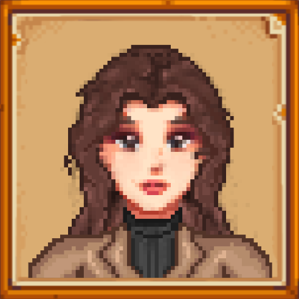
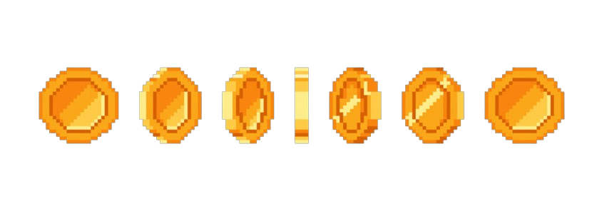
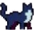
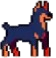

# ForestQuest

## Game Concept & Story

**ForestQuest** is an adventurous 2D platformer where you play as a hero entering a mysterious forest to break an ancient curse. You travel through three unique levels, collect coins, and face different enemies. Your ultimate goal is to defeat the Shadow Wolf, the final boss of the forest.

### Story

The ForestQuest forest is cursed by the dark Shadow Wolf. Monsters roam freely and the forest is unsafe. You, as the player, are a young adventurer determined to save the forest. By completing levels, defeating enemies, and collecting all coins, you get closer to unraveling the mystery and defeating the Shadow Wolf.

---

## Lina (Dialogbox Character)

At the start of the game, you meet **Lina**, a friendly character who appears in a dialogbox to give you instructions and tips about the game. Lina helps you understand the controls, objectives, and how to defeat enemies. Look for her dialogbox at the beginning of your adventure!

- **Description:**
  - Helpful and friendly guide
  - Appears in a dialogbox with useful information
  - Gives advice at the start of the game

---

## Coin

In every level, you can collect coins to progress and unlock new areas. Coins are required to complete each level.

- **Description:**
  - Shiny golden coin with a clear, round shape
  - Animates when picked up
  - Essential for level completion

---

## Your Hero

You play as a **young adventurer** with a red outfit and an axe.  
Below you can see what your hero looks like:

- **Appearance:**
  - Red shirt
  - Brown pants
  - Axe as weapon
  - Various animations for walking, jumping, attacking, and dying

In multiplayer, you play together with a second player, who uses the same sprite.

---

## Enemies

In ForestQuest, you encounter a unique enemy in each level. Below you can see what they look like:

### Level 1: Cat Enemy

- **Description:**  
  Sly cat that moves quickly and attacks unexpectedly.

---

### Level 2: Dog Enemy

- **Description:**  
  Strong dog that defends its territory and is aggressive.

---

### Level 3: Final Boss - Shadow Wolf

- **Description:**  
  The ultimate challenge. Shadow Wolf is fast, powerful, and has multiple attack patterns.

---

## Levels & Objectives

- **Level 1:**
  - Enemy: Cat
  - Collect 10 coins
- **Level 2:**
  - Enemy: Dog
  - Collect 15 coins
- **Level 3:**
  - Enemy: Shadow Wolf (Final Boss)
  - Collect 12 coins

---

## Controls

**Player 1:**

- **Z / Q / S / D** – Move
- **Spacebar** – Attack
- **E** – Interact

**Player 2:**

- **Arrow keys** – Move
- **K** – Attack
- **L** – Interact

**Both players:**

- **Escape / P** – Open/close pause menu

---

## Features

- Singleplayer and local multiplayer
- Three unique levels with different enemies and objectives
- Collect coins and defeat enemies
- Boss battle against Shadow Wolf
- Pause and options menu
- Dynamic camera (split-screen in multiplayer)
- Atmospheric music and sound effects

---

## Goal

Collect all coins, defeat the enemies in each level, and free the forest from the curse of the Shadow Wolf!

---
